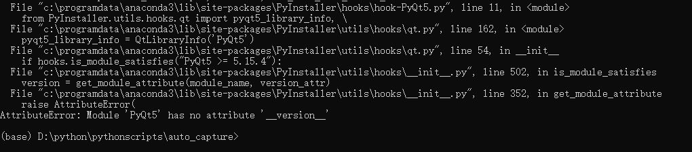
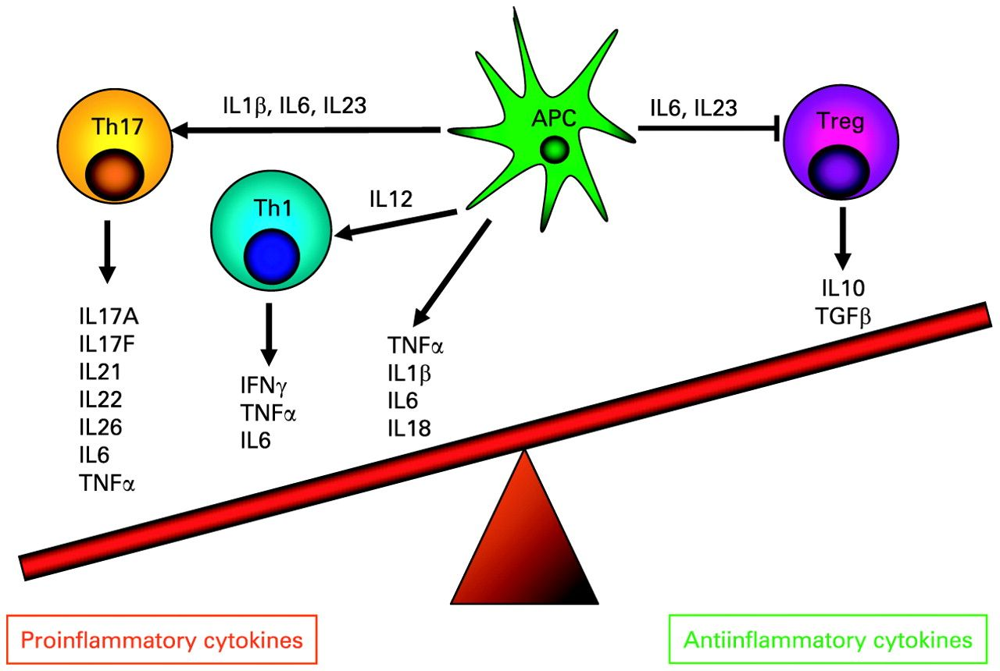

readme
==========
# 一级标题
## 二级标题
### 三级标题
#### 四级标题
##### 五级标题
###### 六级标题

文本
------
### 普通文本
这是一段普通的文本
### 单行文本
  hello大家好，我是bryce
### 文本块
#### 语法1
  欢迎到访  
  很高兴  
  见到您 
#### 语法2
```
欢迎到访    
很高兴  
见到您  
```

### 文字高亮
```
`linux` `网络编程` `socket` `epoll`
```
`linux` `网络编程` `socket` `epoll`

### 换行
直接回车不能换行，   
可以再上一行文本后面补加`两个空格`   
这样下一行的文本就可以换行了 
### 斜体、粗体、删除线
|语法|效果|
|---|---|
|`*斜体1*`|*斜体1*|
|`_斜体_`|_斜体2_|
|`**粗体**`|**粗体**|
|`__粗体__`|__粗体__|
|`这是一个~~删除线~~`|~~删除线~~|
|`***斜粗体***`|***写粗体***|
## tag1 
图片
-------
基本格式：
```

```
-alt 表示图片显示失败时的替代文本  
-title表示鼠标悬停在图片时的显示文本（注意这里要加引号）  
URL即图片的url地址，如果引用本地仓库中的图片，直接适用**相对路径**就可以了，如果引用其它仓库中的图片要注意格式，即：`仓库地址/raw/分支名/图片路径`，如：  
```
https://github.com/guodongxiaren/ImageCache/raw/master/logo/foryou.gif
```
|#|语法|效果|
|---|---|---|
|1 |`` ||







链接
----
### 链接外部URL
|#|语法|效果|
|---|---|---|
|1|`[我的幕布](https://mubu.com/app/edit/home/11na7ejULr4 "悬停显示")`|[我的幕布](https://mubu.com/app/edit/home/11na7ejULr4 "幕布")|

[工资结算](https://github.com/Bryce505/python_practice_learning-by-doing/blob/fc2ad032fb1299fe1e48594179cde7a6f827fd62/%E5%B7%A5%E8%B5%84%E7%BB%93%E7%AE%97.py)

[![weibo-logo]](http://weibo.com/linpiaochen)

### 锚点
[回到顶部](#readme)
## 列表
### 无序列表
#### 语法
* 昵称
* 别名
* 英文名

### 多级无序列表
* 编程语言
  * 借本语言
    * python

### 一级有序列表
#### 语法
面向对象的单个基本特征：
1. 封装
2. 继承
3. 多态

### 多级有序列表
 1. 这是一级的有序列表，数字1还是1
   1. 这是二级的有序列表，阿拉伯数字在显示的时候变成了罗马数字
      1. 这是三级的有序列表，数字在显示的时候变成了英文字母 

### 复选框
- [x] 需求分析
- [ ] 需求分析

## 块引用
> 数据结构
>> 树
>>> 二叉树
>>>> 平衡二叉树

代码高亮
---------
### 语法
在三个反引号后面加上编程语言的名字，另起一行开始写代码，最后一行再加上三个反引号。  
```python
#函数用于计算指定的年月日是这一年的第几天
def is_leap_year(year):
    """
    判断指定的年份是不是闰年
    :param year: 年份
    :return: 闰年返回True平年返回False
    """
    return year % 4 == 0 and year % 100 != 0 or year % 400 == 0

```
# list

表格
-----
表头1|表头2|
----|----|
单元格1|单元格2|
单元格3|单元格4| 

|表头1|表头2|
|----|----|
|单元格1|单元格2|
|单元格3|单元格4| 
   
|表头1|表头2
|----|----
|单元格1|单元格2
|单元格3|单元格4 

|左对齐|居中|右对齐|
|:----|:----:|----:|
|col 3 is   |some wordy text|$1600|
|col 2 is   |centered       |$12  |
|zebra stripes| are neat|$1|

👏
🐥
```diff
+ 人闲桂花落，  
- 夜静春山空，  
！月出惊山鸟，  
# 时鸣春涧中。  
```
图片
------


使用了**URL标识符**
![baidu2][baidu-logo]

链接
----
### 链接外部URL
[我的幕布](https://mubu.com/app/edit/home/16CS4C3PgQ0 "印象标签系统")  
[印象笔记标签系统][yinxiang-tags]

图片链接
----
[![pd-1]][csdn]
![pd-1]
![][pd-1]
![pd-1][csdn]  

[![pd-1]][csdn]
[][csdn]
[回到tag1](#list)

<u> 带下划线的文本</u>
<https://www.runoob.com>
-------------------
[yinxiang-tags]:https://mubu.com/app/edit/home/16CS4C3PgQ0 '幕布'
[csdn]:http://blog.csdn.net/guodongxiaren "我的博客"
[zhihu]:https://www.zhihu.com/people/guodongxiaren "我的知乎，欢迎关注"
[weibo]:http://weibo.com/linpiaochen
[baidu-logo]:http://www.baidu.com/img/bdlogo.gif "百度logo"
[pd-1]:/imageCache/1.jpg "肿瘤免疫"
